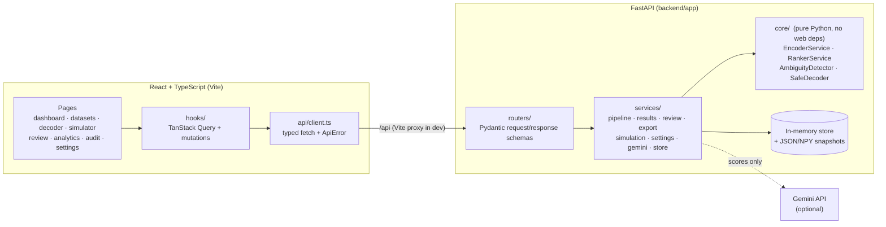
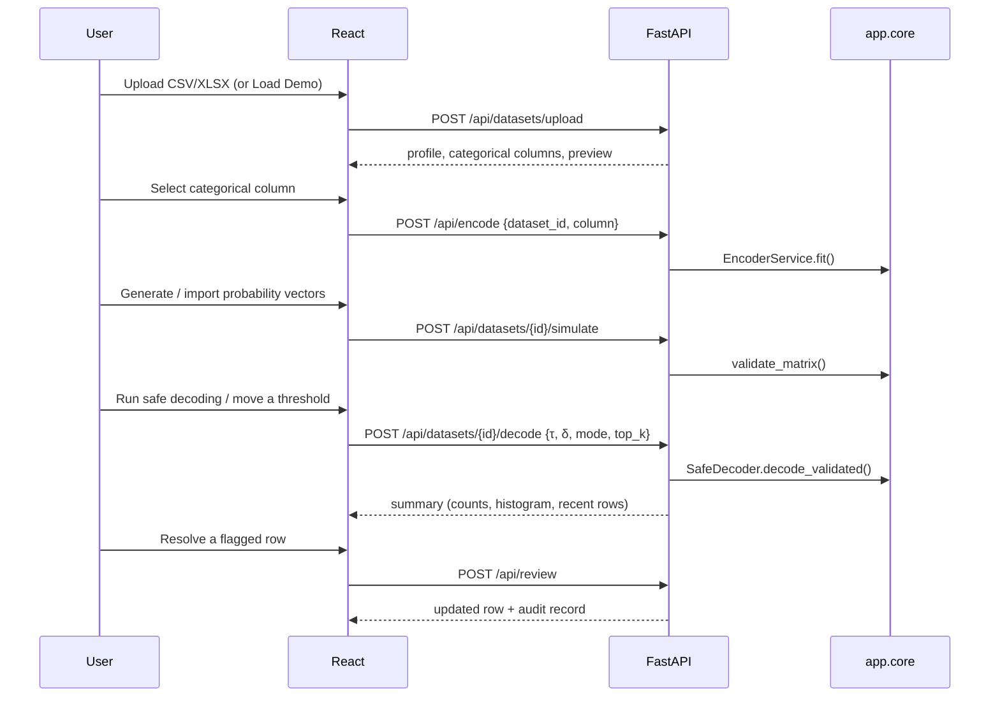

# Ambiguity-Safe Inverse Decoding

**Stop blindly trusting argmax.** A full-stack capstone application that makes the inverse decoding of one-hot / probability vectors safe by detecting low-confidence and near-tie predictions, ranking alternatives, and routing unsafe rows to human review instead of silently accepting them.

```
Standard decoding                 Ambiguity-safe decoding

probabilities                      probabilities
     ↓                                  ↓
   argmax                          confidence check
     ↓                                  ↓
  category                          near-tie check
                                        ↓
                                     ranking
                                        ↓
                             SAFE / UNCERTAIN / AMBIGUOUS / REJECTED
                                        ↓
                              category  OR  human review
```

The project does **not** train a model. Probability vectors come from a built-in simulator, from numeric columns in an uploaded file, or (optionally) from Gemini. **Every safety decision is made locally in Python**, no matter where the vector came from.

---

## Contents

1. [Features](#features)
2. [Architecture](#architecture)
3. [The decoding algorithm](#the-decoding-algorithm)
4. [Strict, soft and advisory modes](#strict-soft-and-advisory-modes)
5. [Setup](#setup)
6. [Environment variables](#environment-variables)
7. [Gemini configuration](#gemini-configuration)
8. [Demo mode](#demo-mode)
9. [API endpoints](#api-endpoints)
10. [Testing](#testing)
11. [Deployment](#deployment)
12. [Project structure](#project-structure)

---

## Features

| Area | What you get |
| --- | --- |
| **Dashboard** | Rows processed, safe / uncertain / ambiguous / rejected counts, average confidence, current thresholds, status donut, argmax-vs-safe outcome bars, recent decoding activity. Empty workspaces show a landing page with an animated decision-flow explanation. |
| **Datasets** | Drag-and-drop CSV/XLSX upload with client + server validation, automatic column profiling, categorical-column detection and suggestion, data preview. |
| **One-hot encoding** | `EncoderService` builds a stable *category → index → one-hot vector* mapping (first appearance, alphabetical or frequency order) shown as a table. |
| **Probability vectors** | Scenario-mix simulator (confident, moderate, near tie, diffuse, overconfident error), import from numeric columns (`p_<category>`), or Gemini scoring. |
| **Decoder** | Live confidence-threshold, near-tie-threshold, top-k and mode controls. Changes re-decode the dataset immediately. |
| **Results table** | Server-side sorting, filtering, search and pagination; status badges; confidence meters; row selection with bulk actions; expandable rows with the full probability vector, top-k ranking and review actions. |
| **Simulator** | Manual sliders, presets (safe / near tie / low confidence / random), normalisation, side-by-side comparison of argmax vs strict / soft / advisory, one-click demo dataset generation. |
| **Review queue** | Flagged rows with top prediction, alternative, confidence, gap and reason. Accept, choose the alternative, choose another category, or reject, with undo. |
| **Audit log** | Every manual decision (timestamp, row, decoder output, selected category, previous → new status, mode, note). |
| **Analytics** | Confidence histogram with threshold marker, status donut, top categories, per-row probability comparison. |
| **Evaluation** | Standard argmax vs safe decoder: accepted, rejected, ambiguous, abstained, accuracy of accepted rows, *unsafe predictions prevented*, coverage/accuracy sweep across thresholds, per-scenario breakdown. |
| **Export** | Full results, corrected dataset, flagged rows and audit log as CSV (with spreadsheet formula-injection protection). |
| **Settings** | Decoder defaults, Gemini status (never exposes the key), API health and limits. |

The frontend uses a warm, restrained visual language (Geist / Geist Mono / Source Serif 4, muted amber accent). Motion (page transitions, staggered reveals, count-up numbers, animated rulers and bars, review-card exits) respects `prefers-reduced-motion`. Status colours were validated for colour-vision deficiency and always ship with an icon and a label.

---

## Architecture



Design rules the code follows:

* **`app/core` is framework-free.** It depends only on NumPy, pandas and scikit-learn, so it can be published as a standalone package. FastAPI, Pydantic schemas and persistence live outside it.
* **Business logic stays out of React.** Decisions, normalisation, example vectors, filtering, sorting and evaluation are computed by the API; components only render and call hooks.
* **Gemini cannot bypass the detector.** Its output is converted into a validated probability vector and passed through `SafeDecoder` like any other vector.

### Pipeline for a dataset



---

## The decoding algorithm

For every probability vector `p` over categories `c₁ … cₖ` (validated: finite, `0 ≤ pᵢ ≤ 1`, correct length, sums to 1 within `PROBABILITY_SUM_TOLERANCE` unless normalisation is requested):

1. **Rank** – sort categories by probability, breaking ties by category index (stable, so audits are reproducible).
2. **Confidence** – `confidence = max(p)` (the top-1 probability).
3. **Gap** – `gap = p(top1) − p(top2)`.
4. **Confidence check** – passes when `confidence ≥ confidence_threshold` (default **0.75**).
5. **Near-tie check** – passes when `gap ≥ near_tie_threshold` (default **0.05**) **and** `gap > 0`. An exact tie is never safe, even with a threshold of 0.
6. **Risk flags** – `LOW_CONFIDENCE`, `NEAR_TIE`, `EXACT_TIE`, `MULTI_WAY_TIE` (three or more categories within δ of the top).
7. **Mode policy** – maps the assessment to a status and (possibly) a prediction.

All comparisons use an absolute tolerance of `1e-9`, because in IEEE-754 `0.50 − 0.45 = 0.04999999999999999`; without it a gap exactly on the threshold would be misclassified.

| Vector | Confidence | Gap | Strict result |
| --- | --- | --- | --- |
| `[0.91, 0.06, 0.03]` | 0.91 ✓ | 0.85 ✓ | **SAFE** → Electronics |
| `[0.48, 0.47, 0.05]` | 0.48 ✗ | 0.01 ✗ | **AMBIGUOUS** → no category |
| `[0.34, 0.33, 0.33]` | 0.34 ✗ | 0.01 ✗ | **AMBIGUOUS** (3-way tie) |
| `[0.60, 0.30, 0.10]` | 0.60 ✗ | 0.30 ✓ | **REJECTED** → no category |
| `[0.75, 0.20, 0.05]` | 0.75 ✓ (boundary) | 0.55 ✓ | **SAFE** |

Structured output (`SafeDecoder.decode` → `POST /api/decode`):

```json
{
  "prediction": null,
  "argmax_prediction": "Electronics",
  "confidence": 0.48,
  "status": "AMBIGUOUS",
  "reason": "Top two categories are too close: Electronics 48.0% vs Furniture 47.0% (gap 1.0% is below the 5.0% near-tie threshold). Confidence 48.0% is also below the 75.0% threshold.",
  "reason_label": "Near tie + low confidence",
  "top_k": [
    { "rank": 1, "category": "Electronics", "index": 0, "probability": 0.48 },
    { "rank": 2, "category": "Furniture", "index": 1, "probability": 0.47 },
    { "rank": 3, "category": "Clothing", "index": 2, "probability": 0.05 }
  ],
  "alternatives": ["…top_k without rank 1…"],
  "gap": 0.01,
  "threshold": 0.75,
  "near_tie_threshold": 0.05,
  "mode": "strict",
  "flags": ["LOW_CONFIDENCE", "NEAR_TIE"],
  "warning": null,
  "requires_review": true
}
```

Using the engine without the web app:

```python
from app.core import DecodeConfig, SafeDecoder

decoder = SafeDecoder(DecodeConfig(confidence_threshold=0.75, near_tie_threshold=0.05, mode="strict", top_k=3))
result = decoder.decode([0.48, 0.47, 0.05], ["Electronics", "Furniture", "Clothing"])
print(result.status.value, result.prediction, round(result.gap, 2))   # AMBIGUOUS None 0.01
```

---

## Strict, soft and advisory modes

All three modes share the same assessment; they differ only in what they return.

| Mode | Both checks pass | Near tie (any confidence) | Low confidence only |
| --- | --- | --- | --- |
| **strict** (abstain) | `SAFE`, prediction = top-1 | `AMBIGUOUS`, prediction = `null` | `REJECTED`, prediction = `null` |
| **soft** (hedge) | `SAFE`, prediction = top-1 | `UNCERTAIN`, prediction = top-1 + top-k alternatives | `UNCERTAIN`, prediction = top-1 + top-k alternatives |
| **advisory** (warn) | `SAFE`, prediction = top-1 | `AMBIGUOUS`, prediction = top-1 + warning | `UNCERTAIN`, prediction = top-1 + warning |

Soft and advisory results carry a `warning` such as `"Low confidence / Near tie"`. Any row that is not `SAFE` appears in the review queue. A manual decision sets the status to `MANUALLY_REVIEWED`; it survives threshold or mode changes and is cleared only when the probability vectors themselves change.

---

## Setup

Requirements: **Python 3.11+** and **Node.js 20.19+ / 22.12+**.

### Quick start (recommended)

A root `package.json` orchestrates both servers with [`concurrently`](https://www.npmjs.com/package/concurrently) so one terminal, one command, does the whole thing:

```bash
npm install              # installs concurrently at the repo root
npm run setup            # creates backend/.venv, installs requirements.txt, npm installs frontend/
npm run both             # runs FastAPI (reload) + Vite dev server together, color-coded output
```

`npm run both` (alias: `npm run dev`) starts:

* **[BACKEND]** — `uvicorn app.main:app --reload` from `backend/`, using `backend/.venv` if it exists (falls back to the system Python otherwise, with a warning)
* **[FRONTEND]** — `vite` from `frontend/`

Press `Ctrl+C` once to stop both; the launcher tree-kills uvicorn's reloader subprocess on Windows so nothing is left running in the background. Other root scripts:

| Script | Does |
| --- | --- |
| `npm run setup:backend` | Create `backend/.venv` (if missing) and install/upgrade `requirements.txt` into it |
| `npm run setup:frontend` | `npm install` inside `frontend/` |
| `npm run dev:backend` / `npm run dev:frontend` | Run just one side |
| `npm run test:backend` | `pytest` inside the backend venv |
| `npm run test:frontend` | `tsc --noEmit` (typecheck) inside `frontend/` |
| `npm run build:frontend` | Production build of the frontend |

Prefer to run each side by hand instead? See the manual steps below.

### Backend

```bash
cd backend
python -m venv .venv
# Windows: .venv\Scripts\activate    macOS/Linux: source .venv/bin/activate
pip install -r requirements.txt
cp .env.example .env        # optional; every setting has a default
uvicorn app.main:app --reload --port 8000
```

Interactive API docs: <http://localhost:8000/api/docs>

### Frontend

```bash
cd frontend
npm install
npm run dev
```

Open <http://localhost:5173>. In development Vite proxies `/api` to `http://127.0.0.1:8000`, so no CORS setup is needed.

### Acceptance walkthrough

1. Start FastAPI and React, open the dashboard.
2. Click **Try Demo**. 300 synthetic products are loaded, encoded, simulated and decoded.
3. Open **Datasets → Demo product catalogue** to see the column profile, select a categorical column, inspect the one-hot mapping, and regenerate vectors.
4. Open **Decoder**. Move the confidence and near-tie sliders and switch strict / soft / advisory; counts and the table update live. Expand a row to inspect its top-k alternatives.
5. Open **Review**, resolve an ambiguous row, then find the decision in **Audit**.
6. Open **Analytics → Evaluation** to compare standard argmax with the safe decoder.
7. Use **Export CSV** for results, the corrected dataset, flagged rows or the audit log.

Sample files for uploads live in [`samples/`](samples):

| File | Categorical column | Notes |
| --- | --- | --- |
| `products.csv` | `product_type` (5 categories) | Plain CSV; select the column and simulate vectors |
| `products.xlsx` | `product_type` (3 categories) | Same idea, as an Excel workbook |
| `products_with_probabilities.csv` | `product_type` | Already has `p_<category>` columns - use *From columns* in step 3 |
| `support_tickets.csv` | `category` (5 categories) | Ticket subject/message text; several categories are deliberately confusable |
| `movie_catalog.xlsx` | `genre` (6 categories) | Excel workbook with a higher-cardinality category |
| `loan_risk_with_probabilities.csv` | `risk_tier` (3 categories) | Pre-computed `p_Low` / `p_Medium` / `p_High` columns, including several genuine near ties |

---

## Environment variables

### Backend (`backend/.env`)

| Variable | Default | Purpose |
| --- | --- | --- |
| `ENVIRONMENT` | `development` | `development`, `production` or `test` |
| `CORS_ORIGINS` | `http://localhost:5173,http://127.0.0.1:5173` | Comma-separated allowed browser origins |
| `MAX_UPLOAD_MB` | `10` | Upload size limit |
| `MAX_ROWS` / `MAX_COLUMNS` | `50000` / `200` | Parsed dataset limits |
| `MAX_CATEGORIES` | `50` | Maximum distinct values in a decodable column |
| `STORAGE_DIR` | `storage` | Snapshot directory (relative to `backend/`) |
| `PERSIST_STATE` | `true` | Save datasets, reviews and settings between restarts |
| `DEFAULT_CONFIDENCE_THRESHOLD` | `0.75` | Initial τ |
| `DEFAULT_NEAR_TIE_THRESHOLD` | `0.05` | Initial δ |
| `DEFAULT_TOP_K` | `3` | 1–10 |
| `DEFAULT_MODE` | `strict` | `strict`, `soft`, `advisory` |
| `PROBABILITY_SUM_TOLERANCE` | `0.001` | Allowed deviation from a sum of 1 |
| `GEMINI_API_KEY` | *(empty)* | Enables the optional Gemini provider |
| `GEMINI_MODEL` | `gemini-2.5-flash` | Model name |
| `GEMINI_MAX_ROWS` / `GEMINI_BATCH_SIZE` | `50` / `20` | Cost controls |
| `GEMINI_TIMEOUT_SECONDS` | `45` | Request timeout |

### Frontend (`frontend/.env`)

| Variable | Default | Purpose |
| --- | --- | --- |
| `VITE_API_BASE_URL` | *(empty)* | API origin for production builds, e.g. `https://api.example.com` |
| `VITE_PROXY_TARGET` | `http://127.0.0.1:8000` | Dev-server proxy target |

---

## Gemini configuration

Gemini is optional. Without a key, the application runs fully offline on simulated vectors and the Gemini buttons are shown as unavailable.

1. Create an API key in Google AI Studio.
2. Add it to `backend/.env`:
   ```env
   GEMINI_API_KEY=your-key
   GEMINI_MODEL=gemini-2.5-flash
   ```
3. Restart the API. **Settings** will show *Configured*.

How it is used:

* **Simulator → Generate predictions with Gemini** classifies a single text.
* **Dataset → Probability vectors → Gemini** scores the first `GEMINI_MAX_ROWS` rows of a text column (remaining rows use simulated vectors).

`GeminiService` asks for a JSON array of 0–100 scores per category (structured output, temperature 0). Scores are cleaned (unknown categories ignored, negative or invalid values → 0) and normalised into a probability vector; if nothing usable comes back the vector is uniform, which the detector flags. The key is only read server-side, sent in the `x-goog-api-key` header, and never returned by any endpoint or included in error messages.

---

## Demo mode

`POST /api/datasets/demo` (the **Try Demo** / **Load demo** buttons) creates a synthetic product catalogue with `Electronics`, `Furniture`, `Clothing`, `Grocery` and `Sports`. Some products are deliberately confusable (e.g. *Smart Fitness Tracker* → Electronics vs Sports, *Yoga Leggings* → Clothing vs Sports), and those rows are more likely to produce near ties.

Default scenario mix (reproducible with seed 42):

| Scenario | Share | Typical vector | Expected outcome |
| --- | --- | --- | --- |
| Confident | 55% | 0.80–0.97 on the true label | SAFE |
| Moderate | 12% | 0.52–0.72 with a clear gap | REJECTED (strict) |
| Near tie | 18% | top two within 4.5 points; 45% have the wrong label on top | AMBIGUOUS |
| Diffuse / low confidence | 10% | almost uniform | AMBIGUOUS / REJECTED |
| Overconfident error | 5% | wrong label at 0.78–0.93 | SAFE (cannot be caught, kept for honest evaluation) |

The evaluation treats the original column value as ground truth and reports how many argmax errors the safe decoder intercepted, how many it still accepted, and how many correct rows it sent to review.

---

## API endpoints

All endpoints are under `/api`; errors share one shape:

```json
{ "error": { "code": "PROBABILITY_SUM_INVALID", "message": "Probabilities sum to 0.6, not 1 …", "details": { "sum": 0.6 } } }
```

| Method | Path | Description |
| --- | --- | --- |
| GET | `/health` | Status, version, Gemini configured, dataset count |
| GET / PUT | `/settings` | Read / save decoder defaults, Gemini status, limits |
| POST | `/settings/reset` | Restore defaults |
| GET | `/datasets` | List datasets |
| POST | `/datasets/upload` | Multipart CSV/XLSX upload → profile + preview |
| POST | `/datasets/demo` | Create (and optionally fully decode) the demo dataset |
| GET / DELETE | `/datasets/{id}` | Dataset detail / delete |
| POST | `/encode` | `{dataset_id, column, order}` selects the categorical column; `{values}` encodes ad-hoc values |
| POST | `/datasets/{id}/simulate` | Generate vectors `{seed, mix}` |
| POST | `/datasets/{id}/probabilities/columns` | Import vectors from numeric columns `{mapping, normalize}` |
| POST | `/datasets/{id}/decode` | Decode with optional `{confidence_threshold, near_tie_threshold, mode, top_k}` |
| POST | `/decode` | Decode a single vector |
| POST | `/decode/batch` | Decode up to 10,000 vectors |
| POST | `/decode/compare` | Same vector under argmax, strict, soft and advisory |
| POST | `/simulate/vector` | Example vector for `safe`, `near_tie`, `low_confidence`, `random` |
| POST | `/simulate/normalize` | Normalise a vector to sum to 1 |
| GET | `/results/{id}` | Paginated rows: `status`, `search`, `sort_by`, `sort_dir`, `page`, `page_size` |
| GET | `/results/{id}/summary` | Counts, histogram, category counts, recent activity |
| GET | `/results/{id}/evaluation` | Argmax vs safe decoder metrics and threshold sweep |
| GET | `/results/{id}/rows/{row_id}` | One row with its full probability vector |
| POST | `/review` | `{dataset_id, row_id, action: accept\|choose\|reject\|revert, category?, note?}` |
| POST | `/review/bulk` | Bulk accept / reject / revert |
| GET | `/audit/{id}` | Audit log (newest first) |
| GET | `/export/{id}?kind=results\|corrected\|ambiguous\|audit` | CSV download |
| GET | `/gemini/status` | Gemini configuration (no secrets) |
| POST | `/gemini/classify` | Classify text with Gemini, then decode locally |
| POST | `/gemini/datasets/{id}` | Score a dataset text column with Gemini |

Error codes include `INVALID_CSV`, `INVALID_XLSX`, `UNSUPPORTED_FILE_TYPE`, `FILE_TOO_LARGE`, `EMPTY_DATASET`, `MISSING_CATEGORICAL_COLUMN`, `MALFORMED_PROBABILITY_VECTOR`, `NEGATIVE_PROBABILITY`, `PROBABILITY_OUT_OF_RANGE`, `PROBABILITY_LENGTH_MISMATCH`, `PROBABILITY_SUM_INVALID`, `INVALID_CATEGORIES`, `INVALID_THRESHOLD`, `NOT_DECODED`, `DATASET_NOT_FOUND` and `GEMINI_NOT_CONFIGURED`. The frontend turns them into toast notifications.

---

## Testing

```bash
cd backend
python -m pytest
```

The suite (98 tests) covers:

* **Core decoding:** high confidence, low confidence, exact tie, near tie, three-way tie, confidence and gap threshold boundaries (including the float-error case), strict / soft / advisory policies, top-k ranking and capping, batch vs single consistency.
* **Validation:** normalisation, zero vectors, probabilities not summing to 1, negative values, values above 1, wrong length, malformed values (strings, `None`, `NaN`), invalid categories, invalid thresholds, row-numbered matrix errors.
* **Services:** one-hot encoding orders, simulator reproducibility and scenario outcomes, CSV/XLSX parsing, invalid uploads, size limits, Gemini score conversion and mocked HTTP (including error messages never containing the key).
* **API end-to-end:** demo pipeline, threshold and mode changes, filtering / sorting / pagination, review → audit → export, bulk review, evaluation metrics, upload → encode → simulate → decode, probability-column import, error codes, settings, Gemini-unavailable responses, persistence across restarts.

Frontend type-check and production build:

```bash
cd frontend
npm run typecheck
npm run build
```

---

## Deployment

**Backend**

```bash
cd backend
pip install -r requirements.txt
ENVIRONMENT=production CORS_ORIGINS=https://your-frontend.example.com \
  uvicorn app.main:app --host 0.0.0.0 --port 8000 --workers 1
```

* State is held in memory and snapshotted to `STORAGE_DIR`; run a **single worker** (or replace `DatasetStore` with a database-backed implementation) and mount `STORAGE_DIR` on a persistent volume.
* Put the API behind HTTPS (a reverse proxy such as Nginx or Caddy, or a platform like Render / Fly.io / Railway) and keep `GEMINI_API_KEY` in the platform's secret store.

**Frontend**

```bash
cd frontend
VITE_API_BASE_URL=https://api.example.com npm run build
```

Serve `frontend/dist` from any static host (Netlify, Vercel, S3 + CloudFront, Nginx) with a single-page-app fallback to `index.html`. Alternatively serve the frontend and API from the same origin and reverse-proxy `/api` to Uvicorn, in which case `VITE_API_BASE_URL` can stay empty.

### Security notes

* The Gemini key exists only in the backend environment; no endpoint returns it.
* Uploads are restricted to `.csv` / `.xlsx`, checked for binary content and ZIP signatures, size-limited while streaming, parsed as data only, and never executed or stored under their original name.
* Every request body and query parameter is validated with Pydantic; probability vectors get additional numeric validation in `app.core`.
* CORS origins come from `CORS_ORIGINS`; credentials are not allowed.
* CSV exports prefix cells starting with `= + - @` to prevent spreadsheet formula injection.

---

## Project structure

```
backend/
  app/
    main.py              FastAPI factory, CORS, error handlers
    config.py            Environment configuration (pydantic-settings)
    dependencies.py      Service container
    core/                Framework-free decoding engine
      encoder.py         EncoderService, CategoryEncoding
      ranker.py          RankerService
      detector.py        AmbiguityDetector
      decoder.py         SafeDecoder + mode policy + reasons
      probability.py     Vector / category validation, normalisation
      types.py           DecodeConfig, DecodeResult, enums
      errors.py          Typed errors with stable codes
    models/              Pydantic request/response schemas
    routers/             system, datasets, decode, results, gemini
    services/            pipeline, results, review, export, simulation,
                         settings, gemini, dataset parsing, store, views
    utils/               App errors, serialisation helpers
  tests/                 pytest suite
  requirements.txt
frontend/
  src/
    api/                 Typed client + endpoint functions
    components/          ui/, layout/, decoding/, charts/, datasets/, common/
    hooks/               Queries, mutations, active dataset, review & draft hooks
    layouts/             App shell with animated page transitions
    lib/                 Formatting, status metadata, helpers
    pages/               Dashboard, Datasets, DatasetDetail, Decoder, Simulator,
                         Review, Analytics, Audit, Settings, NotFound
    types/               API types mirroring the Pydantic schemas
    App.tsx, main.tsx, index.css
samples/                 Example CSV / XLSX files
```
